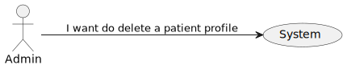
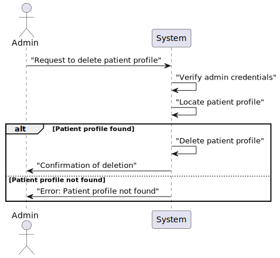

# US10 - As an Admin, I want to delete a patient profile

## 1. Requirements Engineering

### 1.1. User Story Description

As an Admin, I want to delete a patient profile, so that I can remove patients who are no longer under care.

### 1.2. Acceptance Criteria

**AC1**- - Admins can search for a patient profile and mark it for deletion.

**AC2**- - Before deletion, the system prompts the admin to confirm the action.

**AC3**- Once deleted, all patient data is permanently removed from the system within a predefined time frame.

**AC4**- The system logs the deletion for audit and GDPR compliance purposes.

### 1.3. Found out Dependencies

* There is a dependency with US 5.1.8 "As an Admin, I want to create a new patient profile, so that I can register their personal details and medical history."

### 1.4 Input and Output Data

**Input Data:**

* Typed data:
    n/a

* Selected Data:
    Selected Patient Profile

**Output Data:**

*  Patient profile deleted 
* (In)Success of the operation

### 1.5. System Views

### Level 1

#### Scenario view

#### Logic view

### Level 2

#### Logic View

#### Process view

### Level 3

#### Logic view

#### Development view

### Level 4

#### Logic view

