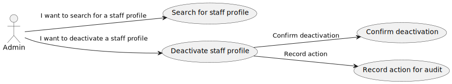
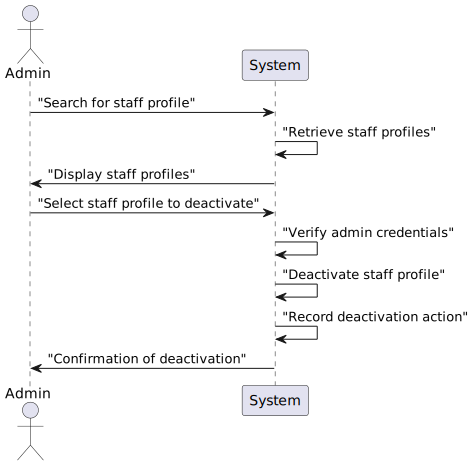

# US14 - As an Admin, I want to deactivate a staff profile

## 1. Requirements Engineering

### 1.1. User Story Description

As an Admin, I want to deactivate a staff profile, so that I can remove them from the hospital’s active roster without losing their historical data.

### 1.2. Acceptance Criteria

**AC1**- - - Admins can search for and select a staff profile to deactivate.

**AC2**- - Deactivating a staff profile removes them from the active roster, but their historical data (e.g.,appointments) remains accessible.

**AC3**- The system confirms deactivation and records the action for audit purposes.

### 1.3. Found out Dependencies

* There is a dependency with US 5.1.12 "As an Admin, I want to create a new staff profile, so that I can add them to the hospital’s roster."

### 1.4 Input and Output Data

**Input Data:**

* Typed data:
    n/a

* Selected Data:
    Selected Staff Profile

**Output Data:**

* Staff profile deactivated
* (In)Success of the operation

### 1.5. System Views

### Level 1

#### Scenario view

#### Logic view

### Level 2

#### Logic View

#### Process view

### Level 3

#### Logic view

#### Development view

### Level 4

#### Logic view

