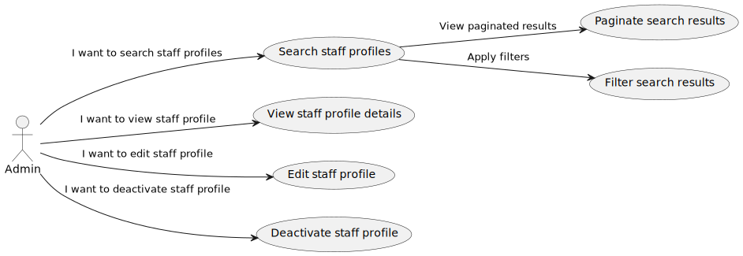
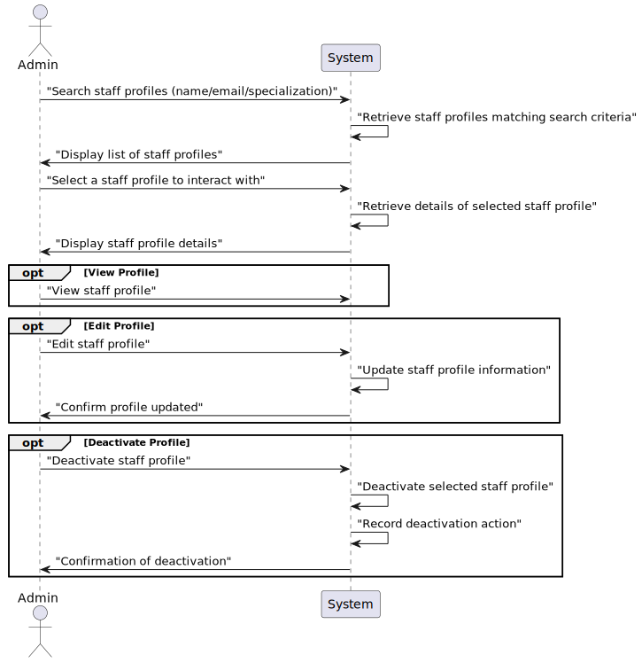

# US15 - As an Admin, I want to list/search staff profiles

## 1. Requirements Engineering

### 1.1. User Story Description

 As an Admin, I want to list/search staff profiles, so that I can see the details, edit, and remove staff profiles.

### 1.2. Acceptance Criteria

**AC1**- Admins can search staff profiles by attributes such as name, email, or specialization

**AC2**- The system displays search results in a list view with key staff information (name, email, specialization).

**AC3**- Admins can select a profile from the list to view, edit, or deactivate.

**AC4**- The search results are paginated, and filters are available for refining the search results.

### 1.3. Found out Dependencies

* There is a dependency with US 5.1.12 "As an Admin, I want to create a new staff profile, so that I can add them to the hospital’s roster."
* There is a dependency with US 5.1.13 "As an Admin, I want to edit a staff’s profile, so that I can update their information."
* There is a dependency with US 5.1.14 "As an Admin, I want to deactivate a staff profile, so that I can remove them from the hospital’s active roster without losing their historical data."

### 1.4 Input and Output Data

**Input Data:**

* Typed data:
    name
    email
    specialization

* Selected Data:
    Selected Staff Profile

**Output Data:**

*  Patient profile viewed, or edited or deactivated
* (In)Success of the operation

### 1.5. System Views

### Level 1

#### Scenario view

#### Logic view

### Level 2

#### Logic View

#### Process view

### Level 3

#### Logic view

#### Development view

### Level 4

#### Logic view

