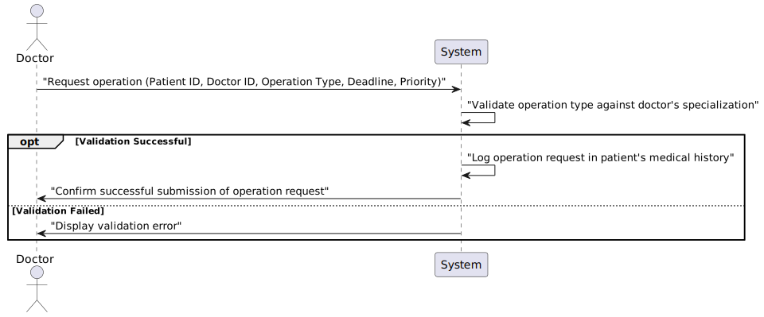

# US16 - As a Doctor, I want to request an operation

## 1. Requirements Engineering

### 1.1. User Story Description

As a Doctor, I want to request an operation, so that the Patient has access to the necessary healthcare.

### 1.2. Acceptance Criteria

**AC1**- Doctors can create an operation request by selecting the patient, operation type, priority, and suggested deadline.

**AC2**- The system validates that the operation type matches the doctor’s specialization.

**AC3**- The operation request includes:
 - Patient ID
 - Doctor ID
 - Operation Type
 - Deadline
 - Priority

**AC4**- - The system confirms successful submission of the operation request and logs the request in the patient’s medical history.

### 1.3. Found out Dependencies

* There is a dependency with User Storie 5.1.20 "As an Admin, I want to add new types of operations, so that I can reflect on the available medical procedures in the system."

### 1.4 Input and Output Data

**Input Data:**

* Typed data:
    - Patient ID
    - Doctor ID
    - Operation Type
    - Deadline
    - Priority

* Selected Data:
    

**Output Data:**

* Operation Request Created
* (In)Success of the operation

### 1.5. System Views

### Level 1

#### Scenario view

#### Logic view

### Level 2

#### Logic View

#### Process view

### Level 3

#### Logic view

#### Development view

### Level 4

#### Logic view

