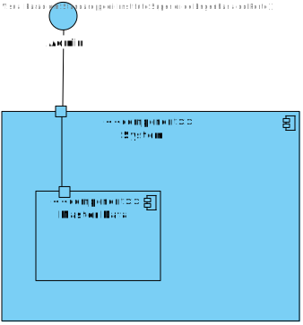

# US21 - As an Admin, I want to edit existing operation types

## 1. Requirements Engineering

### 1.1. User Story Description

 As an Admin, I want to edit existing operation types, so that I can update or correct information about the procedure.

### 1.2. Acceptance Criteria

**AC1**- Admins can search for and select an existing operation type to edit.

**AC2**- Editable fields include operation name, required staff by specialization, and estimated
duration.

**AC3**- Changes are reflected in the system immediately for future operation requests.

**AC4**- Historical data is maintained, but new operation requests will use the updated operation type
information.

### 1.3. Found out Dependencies

* There is a dependency with US 5.1.20 "As an Admin, I want to add new types of operations, so that I can reflect on the available medical procedures in the system."

### 1.4 Input and Output Data

**Input Data:**

* Typed data:
    name
    specialization
    estimated duration

* Selected Data:
    operation type

**Output Data:**

*  Operation type updated
* (In)Success of the operation

### 1.5. System Views

### Level 1

#### Scenario view

#### Logic view

### Level 2

#### Logic View

#### Process view

### Level 3

#### Logic view

#### Development view

### Level 4

#### Logic view

