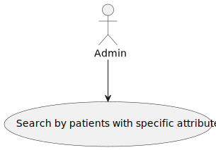
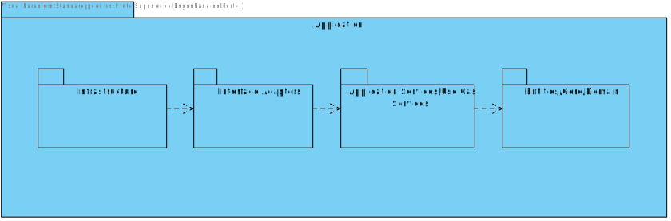

# US11 - Search/list for patient profile by different attributes

## 1. Requirements Engineering

### 1.1. User Story Description

As an Admin, I want to list/search patient profiles by different attributes, so that I
can view the details, edit, and remove patient profiles.

### 1.2. Acceptance Criteria

**AC1** - Admins can search patient profiles by various attributes, including name, email, date of birth,
or medical record number.

**AC2** - The system displays search results in a list view with key patient information (name, email, date
of birth).

**AC3** - Admins can select a profile from the list to view, edit, or delete the patient record.

**AC4** - The search results are paginated, and filters are available to refine the search results.

### 1.3. Found out Dependencies

* There is a dependency with US6, because the admin has to be authenticated to check the patient's profiles

### 1.4 Input and Output Data

**Input Data:**

* Typed data:
    * a name
    * an email
    * a date of birth
    * a medical number
    * the page
    * the page size

**Output Data:**

* id of the patient
* first name of the patient
* last name of the patient
* email of the patient
* birthday of the patient

### 1.5. System Views

### Level 1

#### Scenario view

#### Logic view

### Level 2

#### Logic View

#### Process view

### Level 3

#### Logic view

#### Development view

### Level 4

#### Logic view

