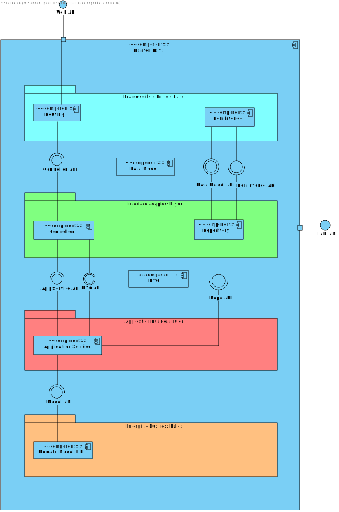

# US17 - As a doctor, update an operation requisition

## 1. Requirements Engineering

### 1.1. User Story Description

As a Doctor, I want to update an operation requisition, so that the Patient has access to the necessary healthcare.

### 1.2. Acceptance Criteria

**AC1** - Doctors can update operation requests they created (e.g., change the deadline or priority).

**AC2** - The system checks that only the requesting doctor can update the operation request.

**AC3** - The system logs all updates to the operation request (e.g., changes to priority or deadline).

**AC4** - Updated requests are reflected immediately in the system and notify the Planning Module of
any changes.

### 1.3. Found out Dependencies

* There is a dependency with US6, because the doctor has to be authenticated to check his operations requisitions.

### 1.4 Input and Output Data

**Input Data:**

* Typed data:
    * an operation request id
    * a priority
    * a deadline

**Output Data:**

* (In)success of an operation

### 1.5. System Views

### Level 1

#### Scenario view

#### Logic view

### Level 2

#### Logic View

#### Process view

### Level 3

#### Logic view

#### Development view

### Level 4

#### Logic view

