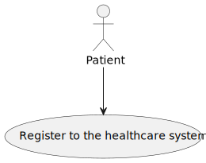
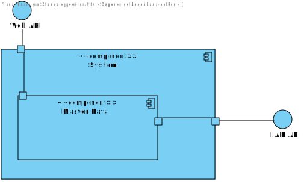
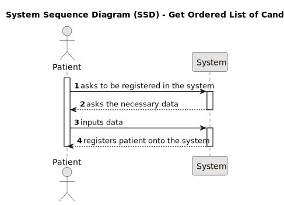
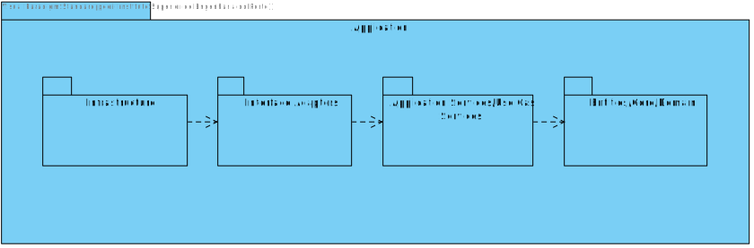
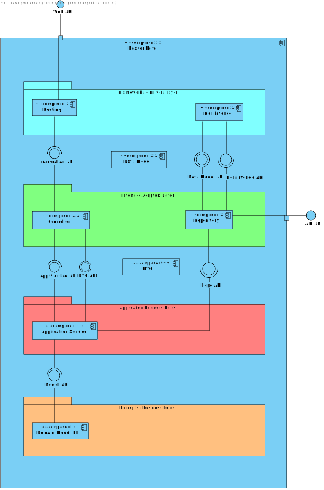

# US3 - As a patient, register to the healthcare

## 1. Requirements Engineering

### 1.1. User Story Description

As a Patient, I want to register for the healthcare application, so that I can create a user profile and book appointments online.

### 1.2. Acceptance Criteria

**AC1**- Patients can self-register using the external IAM system.

**AC2**- During registration, patients provide personal details (e.g., name, email, phone) and create a
profile.

**AC3**- The system validates the email address by sending a verification email with a confirmation link.

**AC4**- Patients cannot list their appointments without completing the registration process.

### 1.3. Found out Dependencies

* There is a dependency with US7, because the account created in this user story will be used in that Us.

### 1.4 Input and Output Data

**Input Data:**

* Typed data:
    * a username
    * an email address
    * a first name
    * a last name
    * the user birthday
    * the gender
    * the medical number
    * the phone number
    * the emergency contact
    * a list of medical conditions

**Output Data:**

* New user registered in the system
* (In)Success of the operation

### 1.5. System Views

### Level 1

#### Scenario view

#### Logic view

### Level 2

#### Logic View

#### Process view

### Level 3

#### Logic view

#### Development view

### Level 4

#### Logic view

