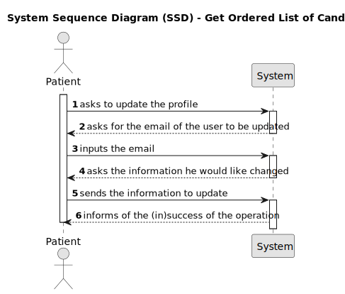

# US4 - As a patient update my user profile 

## 1. Requirements Engineering

### 1.1. User Story Description

As a Patient, I want to update my user profile, so that I can change my personal
details and preferences.

### 1.2. Acceptance Criteria

**AC1** -  Patients can log in and update their profile details (e.g., name, contact information,
preferences).

**AC2** - Changes to sensitive data, such as email, trigger an additional verification step (e.g.,
confirmation email).

**AC3** - All profile updates are securely stored in the system.

**AC4** - The system logs all changes made to the patient's profile for audit purposes.

### 1.3. Found out Dependencies

* There is a dependency with US7, because the user has to be logged in to be able to update its profile.

### 1.4 Input and Output Data

**Input Data:**

* Typed data:
    * a first name
    * a last name
    * a valid phone number
    * a valid emergency contact       
  

* Selected data:
    * an email of the user to alter

**Output Data:**
* (In)success of altering the data

### 1.6. System Views

### Level 1

#### Scenario view

#### Logic view

### Level 2

#### Logic View

#### Process view

### Level 3

#### Logic view

#### Development view

### Level 4

#### Logic view

