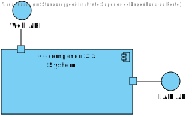

# US5 - As a patient delete my user account

## 1. Requirements Engineering

### 1.1. User Story Description

As a Patient, I want to delete my account and all associated data, so that I can
exercise my right to be forgotten as per GDPR.

### 1.2. Acceptance Criteria

**AC1** - Patients can request to delete their account through the profile settings.

**AC2** - The system sends a confirmation email to the patient before proceeding with account deletion.

**AC3** - Upon confirmation, all personal data is permanently deleted from the system within the legally required time frame (e.g., 30 days).

**AC4** - Patients are notified once the deletion is complete, and the system logs the action for GDPR compliance.

**AC5** - Some anonymized data may be retained for legal or research purposes, but all identifiable information is erased.

### 1.4. Found out Dependencies

* There is a dependency with US7, because the user has to be logged in to be able to delete its account.

### 1.5 Input and Output Data

**Input Data:**

* Typed data:
    * the email address of the account to delete

**Output Data:**

* (In)Success of the account deletion

### 1.6. System Views

### Level 1

#### Scenario view

#### Logic view

### Level 2

#### Logic View

#### Process view

### Level 3

#### Logic view

#### Development view

### Level 4

#### Logic view

