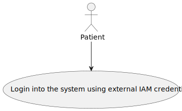
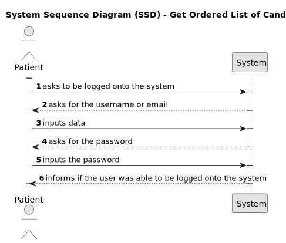

# US7 - As a patient login to system using external IAM credentials 

## 1. Requirements Engineering

### 1.1. User Story Description

As a Patient, I want to log in to the healthcare system using my external IAM
credentials, so that I can access my appointments, medical records, and other
features securely.

### 1.2. Acceptance Criteria

* **AC1:** Backoffice users (e.g., doctors, nurses, technicians) are registered by an Admin via an internal
process, not via self-registration.
* **AC2:** Admin assigns roles (e.g., Doctor, Nurse, Technician) during the registration process.
* **AC3:** Registered users receive a one-time setup link via email to set their password and activate their
account.
* **AC4:** The system enforces strong password requirements for security.
* **AC5:** A confirmation email is sent to verify the user’s registration. 

### 1.3 Found out Dependencies

* There is a dependency with US3, because the profile creation is done in that US.

### 1.4 Input and Output Data

**Input Data:**

* Typed data:
    * an username or an email address
    * a password

**Output Data:**

* Access token

### 1.5. System Views

### Level 1

#### Scenario view

#### Logic view

### Level 2

#### Logic View

#### Process view

### Level 3

#### Logic view

#### Development view

### Level 4

#### Logic view

