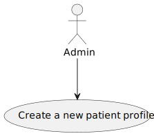
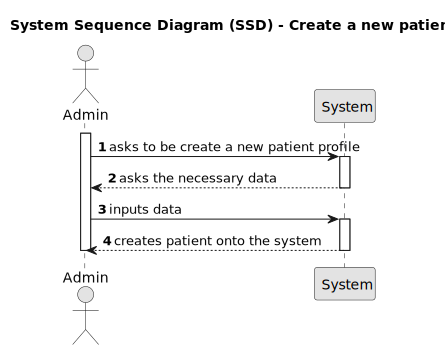
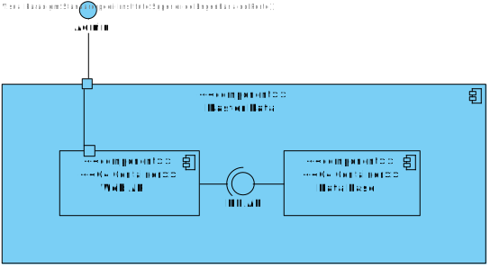

# US8 - To create a new patient profile
## 1. Requirements Engineering
### 1.1. User Story Description
As an Admin, I want to create a new patient profile, so that I can register their personal details and medical history.

### 1.2. Acceptance Criteria
* **AC1**: Admins can input patient details such as first name, last name, date of birth, contact information, and medical history.
* **AC2**: A unique patient ID (Medical Record Number) is generated upon profile creation.
* **AC3**: The system validates that the patient’s email and phone number are unique.
* **AC4**: The profile is stored securely in the system, and access is governed by role-based permissions.

### 1.3. Found out Dependencies
n/a

### 1.4. Input and Output Data
Input Data:

Typed data:
First name
Last name
Date of birth
Contact information (email, phone)
Medical history

Output Data:
New patient profile created in the system
(In)Success of the operation

### 1.5. System Views

### Level 1

#### Scenario view

#### Logic view

### Level 2

#### Logic View

#### Process view

### Level 3

#### Logic view

#### Development view

### Level 4

#### Logic view

