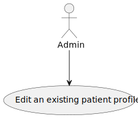
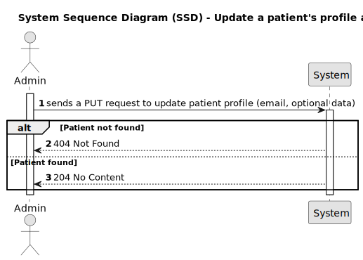

# US9 - Edit an existing patient profile

## 1. Requirements Engineering

### 1.1. User Story Description

As an Admin, I want to edit an existing patient profile, so that I can update their information when needed.

### 1.2. Acceptance Criteria

- Admins can search for and select a patient profile to edit.
- Editable fields include name, contact information, medical history, and allergies.
- Changes to sensitive data (e.g., contact information) trigger an email notification to the patient.
- The system logs all profile changes for auditing purposes.

### 1.3. Found out Dependencies

* n/a

## Input and Output Data
**Input Data:**

* Route parameter:
* email (string) - Email address of the patient to update.
* Query parameters (optional):
* firstName (string) - New first name for the patient.
* lastName (string) - New last name for the patient.
* phone (string) - New phone number for the patient.
* emergencyContact (string) - New emergency contact for the patient.
* medicalConditions (List<string>) - Updated list of medical conditions.
**Output Data:**

* **On success:**

*Patient profile updated.
*Audit log created to track changes.
*204 No Content response.
* **On failure:**

* 404 Not Found if the patient with the given email or ID does not exist.
* 500 Internal Server Error or other appropriate status codes in case of database concurrency issues or other exceptions.

### 1.5. System Views

### Level 1

#### Scenario view

#### Logic view

### Level 2

#### Logic View

#### Process view

### Level 3

#### Logic view

#### Development view

### Level 4

#### Logic view

