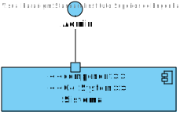

# US12 - To create a new staff profile

## 1. Requirements Engineering

### 1.1. User Story Description

As an Admin, I want to create a new staff profile, so that I can add them to the hospital’s roster.

### 1.2. Acceptance Criteria

- Admins can input staff details such as first name, last name, contact information, and
specialization.
- A unique staff ID (License Number) is generated upon profile creation.
- The system ensures that the staff’s email and phone number are unique.
- The profile is stored securely, and access is based on role-based permissions.

### 1.3. Found out Dependencies

* n/a

### 1.4 Input and Output Data

**Input Data:**

* Typed data:
- Username (string) - The username for the new staff member.
- FirstName (string) - The first name of the new staff member.
- LastName (string) - The last name of the new staff member.
- LicenseNumber (string) - The license number of the new staff member.
- Phone (string) - The phone number of the new staff member.
- Email (string) - The email address of the new staff member.
* Optional data:
- Specialization (string) - The specialization of the new staff member.
- Role (string) - The role for the new staff member.
- AvailabilitySlots (List<string>) - Availability slots for the new staff member.
* Output Data:

* On success:

- New staff member registered in the system.
- 201 Created response, along with the newly created staff member details.
* On failure:

- 400 Bad Request if required fields (first name, last name, license number, phone, or email) are missing.
- 409 Conflict if a staff member with the same license number, phone number, or email already exists.

### 1.5. System Views

### Level 1

#### Scenario view

#### Logic view

### Level 2

#### Logic View

#### Process view

### Level 3

#### Logic view

#### Development view

### Level 4

#### Logic view

