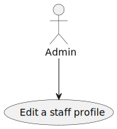
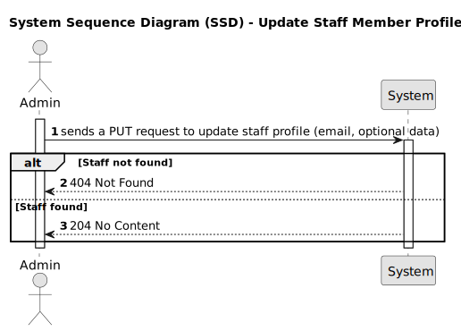
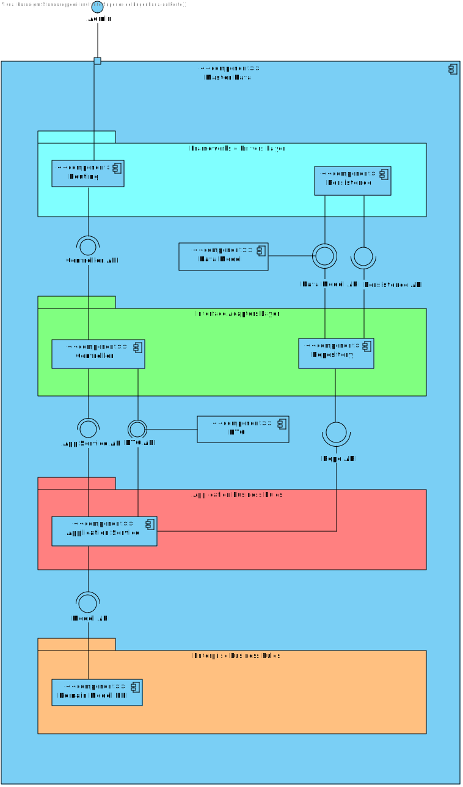

# US13 - To edit a staff’s profile

## 1. Requirements Engineering

### 1.1. User Story Description

As an Admin, I want to edit a staff’s profile, so that I can update their information.

### 1.2. Acceptance Criteria

- Admins can search for and select a staff profile to edit.
- Editable fields include contact information, availability slots, and specialization.
- The system logs all profile changes, and any changes to contact information trigger a
confirmation email to the staff member.
- The edited data is updated in real-time across the system.

### 1.3. Found out Dependencies

* n/a

### 1.4 Input and Output Data

**Input Data:**

* Route parameter:
- email (string) - Email address of the staff member to update.
- Query parameters (optional):
- firstName (string) - New first name for the staff member.
- lastName (string) - New last name for the staff member.
- phone (string) - New phone number for the staff member.
- specializationId (long?) - ID of the new specialization for the staff member.
- role (string) - New role for the staff member.
- availabilitySlots (List<AvailabilitySlot>) - New availability slots for the staff member.
* Output Data:

* On success:

- Staff profile updated in the system.
- Audit log created to track changes.
- 204 No Content response.
* On failure:

- 404 Not Found if the staff member with the given email does not exist.
- 500 Internal Server Error or other appropriate status codes in case of concurrency issues or other exceptions.

### 1.5. System Views

### Level 1

#### Scenario view

#### Logic view

### Level 2

#### Logic View

#### Process view

### Level 3

#### Logic view

#### Development view

### Level 4

#### Logic view

