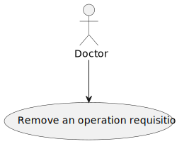
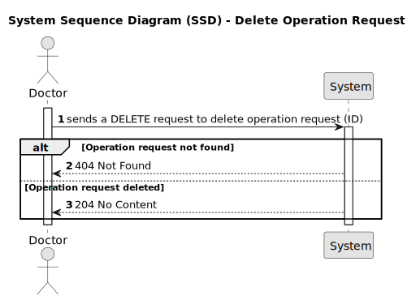

# US18 - To remove an operation requisition 

## 1. Requirements Engineering

### 1.1. User Story Description

As a Doctor, I want to remove an operation requisition, so that the healthcare activities are provided as necessary.

### 1.2. Acceptance Criteria

- Doctors can delete operation requests they created if the operation has not yet been
scheduled.
10
- A confirmation prompt is displayed before deletion.
- Once deleted, the operation request is removed from the patient’s medical record and cannot
be recovered.
- The system notifies the Planning Module and updates any schedules that were relying on this
request.

### 1.3. Found out Dependencies

* n/a

### 1.4 Input and Output Data

**Input Data:**

* Route parameter:
- id (long) - ID of the operation request to delete.
* Output Data:

* On success:

- Operation request deleted from the system.
- 204 No Content response.
* On failure:

- 404 Not Found if the operation request with the given ID does not exist.
- 400 Bad Request for invalid operations or if an exception occurs during processing.
- 500 Internal Server Error for other unhandled exceptions.

### 1.5. System Views

### Level 1

#### Scenario view

#### Logic view

### Level 2

#### Logic View

#### Process view

### Level 3

#### Logic view

#### Development view

### Level 4

#### Logic view

