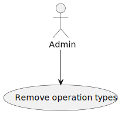
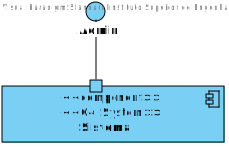
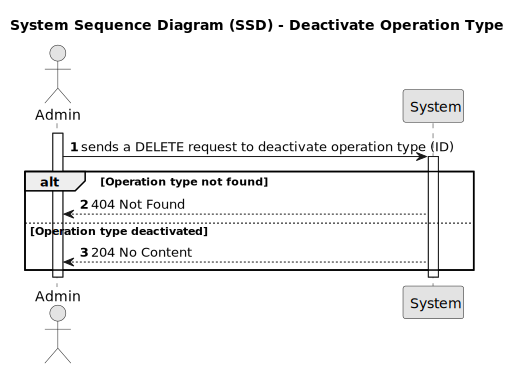

# US22 - To remove operation types

## 1. Requirements Engineering

### 1.1. User Story Description

 As an Admin, I want to remove obsolete or no longer performed operation types, so that the system stays current with hospital practices.

### 1.2. Acceptance Criteria

- Admins can search for and mark operation types as inactive (rather than deleting them) to
preserve historical records.
- Inactive operation types are no longer available for future scheduling but remain in historical
data.
- A confirmation prompt is shown before deactivating an operation type.

### 1.3. Found out Dependencies

* n/a

### 1.4 Input and Output Data

**Input Data:**

* Route parameter:
- id (long) - ID of the operation type to deactivate.
* Output Data:

*  On success:

- Operation type deactivated in the system.
- 204 No Content response.
* On failure:

- 404 Not Found if the operation type with the given ID does not exist.
- 400 Bad Request for invalid operations or if an exception occurs during processing.
- 500 Internal Server Error for other unhandled exceptions.

### 1.5. System Views

### Level 1

#### Scenario view

#### Logic view

### Level 2

#### Logic View

#### Process view

### Level 3

#### Logic view

#### Development view

### Level 4

#### Logic view

