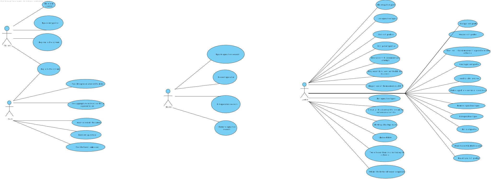

# US1 - To register backoffice users 

## 1. Requirements Engineering

### 1.1. User Story Description

As an Admin, I want to register new backoffice users (e.g., doctors, nurses, technicians, admins) via an out-of-band process, so that they can access the backoffice system with appropriate permissions.

### 1.2. Customer Specifications and Clarifications

**From the client clarifications:**

> **Question:** What are the system's password requirements?

> **Answer:** At least 10 characters long, at least a digit, a capital letter and a special character.

### 1.3. Acceptance Criteria

* **AC1:** Backoffice users (e.g., doctors, nurses, technicians) are registered by an Admin via an internal
process, not via self-registration.
* **AC2:** Admin assigns roles (e.g., Doctor, Nurse, Technician) during the registration process.
* **AC3:** Registered users receive a one-time setup link via email to set their password and activate their
account.
* **AC4:** The system enforces strong password requirements for security.
* **AC5:** A confirmation email is sent to verify the user’s registration. 

### 1.4. Found out Dependencies

* n/a

### 1.5 Input and Output Data

**Input Data:**

* Typed data:
    * a username
    * an email address

* Selected data:
    * A role for the user.

**Output Data:**

* New user registered in the system
* (In)Success of the operation

### 1.6. System Views

### Level 1

#### Logic view

#### Scenario view

#### Process view

### Level 2

#### Logic View

### Level 3

#### Logic view

#### Development view

### Level 4

#### Logic view

 

