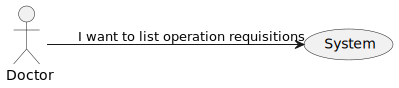
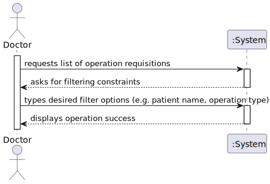

# US19 - To list operation requisitions

## 1. Requirements Engineering

### 1.1. User Story Description

As a Doctor, I want to list/search operation requisitions, so that I see the details,
edit, and remove operation requisitions

### 1.2. Acceptance Criteria

* **AC1:** Doctors can search operation requests by patient name, operation type, priority, and status.
* **AC2:** The system displays a list of operation requests in a searchable and filterable view.
* **AC3:** Each entry in the list includes operation request details (e.g., patient name, operation type,
status).
* **AC4:** Doctors can select an operation request to view, update, or delete it.

### 1.4. Found out Dependencies

There is a dependency to US20 and US16.

### 1.5 Input and Output Data

**Input Data:**

* Typed data:
    * patient name
    * operation type
    * priority
    * status

**Output Data:**

* Filtered requests list
* (In)Success of the operation

### 1.6. System Views

### Level 1

#### Logic view

#### Scenario view

#### Process view

### Level 2

#### Logic View

### Level 3

#### Logic view

#### Development view

### Level 4

#### Logic view

