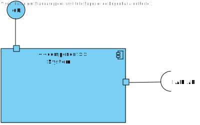

# US2 - To reset the password

## 1. Requirements Engineering

### 1.1. User Story Description

As a Backoffice User (Admin, Doctor, Nurse, Technician), I want to reset my
password if I forget it, so that I can regain access to the system securely.

### 1.2. Customer Specifications and Clarifications

**From the client clarifications:**

> **Question:** What are the system's password requirements?

> **Answer:** At least 10 characters long, at least a digit, a capital letter and a special character.

### 1.3. Acceptance Criteria

* **AC1:** Backoffice users can request a password reset by providing their email.
* **AC2:** The system sends a password reset link via email.
* **AC3:** The reset link expires after a predefined period (e.g., 24 hours) for security.
* **AC4:** Users must provide a new password that meets the system’s password complexity rules.

### 1.4. Found out Dependencies

There is a dependency to US1 because in order to ask for a password reset email, the backoffice user must be registered in the system in the first place.

### 1.5 Input and Output Data

**Input Data:**

* Typed data:
    * an email address

**Output Data:**

* (In)Success of the operation

### 1.6. System Views

### Level 1

#### Logic view

#### Scenario view

#### Process view

### Level 2

#### Logic View

### Level 3

#### Logic view

#### Development view

### Level 4

#### Logic view

