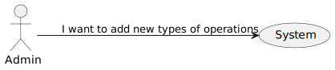
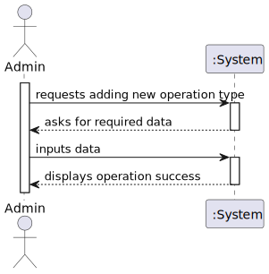

# US1 - To add new operation types

## 1. Requirements Engineering

### 1.1. User Story Description

As an Admin, I want to add new types of operations, so that I can reflect the
available medical procedures in the system.

### 1.2. Customer Specifications and Clarifications

**From the client clarifications:**

> **Question:** Can we assume while creating a new operation type, that the surgery must always have this 3 phases?

> **Answer:** Yes.

### 1.3. Acceptance Criteria

* **AC1:** The system validates that the operation name is unique.
* **AC2:** The system logs the creation of new operation types and makes them available for scheduling
immediately.

### 1.4. Found out Dependencies

* n/a

### 1.5 Input and Output Data

**Input Data:**

* Typed data:
    * a username
    * an email address

* Selected data:
    * A role for the user.

**Output Data:**

* New user registered in the system
* (In)Success of the operation

### 1.6. System Views

### Level 1

#### Logic view

#### Scenario view

#### Process view

### Level 2

#### Logic View

### Level 3

#### Logic view

#### Development view

### Level 4

#### Logic view

