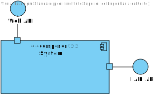
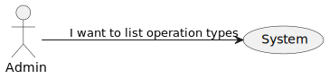
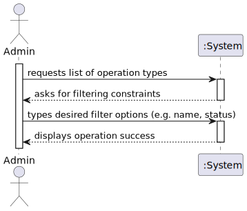
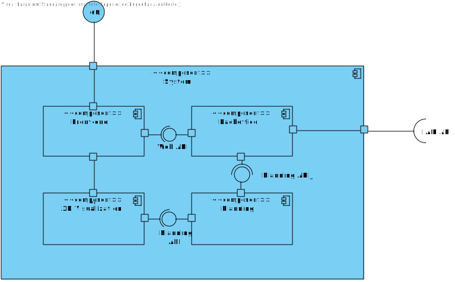

# US23 - To list operation types

## 1. Requirements Engineering

### 1.1. User Story Description

As an Admin, I want to list/search operation types, so that I can see the details,
edit, and remove operation types.

### 1.2. Acceptance Criteria

* **AC1:** Admins can search and filter operation types by name, specialization, or status
(active/inactive).
* **AC2:** The system displays operation types in a searchable list with attributes such as name, required
staff, and estimated duration.
* **AC3:** Admins can select an operation type to view, edit, or deactivate it.

### 1.4. Found out Dependencies

* US20

### 1.5 Input and Output Data

**Input Data:**

* Typed data:
    * operation name
    * specialization
    * status

**Output Data:**

* Filtered operation types list
* (In)Success of the operation

### 1.6. System Views

### Level 1

#### Logic view

#### Scenario view

#### Process view

### Level 2

#### Logic View

### Level 3

#### Logic view

#### Development view

### Level 4

#### Logic view

