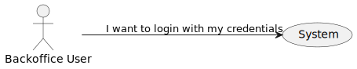

# US6 - To log in to the system

## 1. Requirements Engineering

### 1.1. User Story Description

As a (non-authenticated) Backoffice User, I want to log in to the system using my
credentials, so that I can access the backoffice features according to my assigned
role.

### 1.2. Acceptance Criteria

* **AC1:** Backoffice users log in using their username and password.
* **AC2:**  Role-based access control ensures that users only have access to features appropriate to their
role (e.g., doctors can manage appointments, admins can manage users and settings).
* **AC3:** After five failed login attempts, the user account is temporarily locked, and a notification is
sent to the admin.
* **AC4:** Login sessions expire after a period of inactivity to ensure security.

### 1.4. Found out Dependencies

There is a dependency to US1 because the user needs to be registered to log in to the system

### 1.5 Input and Output Data

**Input Data:**

* Typed data:
    * username/email
    * password

**Output Data:**

* (In)Success of the operation

### 1.6. System Views

### Level 1

#### Logic view

#### Scenario view

#### Process view

### Level 2

#### Logic View

### Level 3

#### Logic view

#### Development view

### Level 4

#### Logic view

