- [Views](#views)
    - [Nível 1](#nível-1)
        - [Vista de Cenário]()
        - [Vista Lógica](#vista-lógica)
        - [Vista de Processos]()
    - [Nível 2](#nível-2)
        - [Vista Lógica](#vista-lógica-1)
        - [Vista de Implementação]()
    - [Nível 3](#nível-3) 
        - [Vista lógica](#vista-lógica-2)
        - [Vista de Implementação](#vista-de-implementação-1)
        - [Vista de Processos](#vista-de-processos-1)
- [Mapping](#mapping)

---

# Views

## Nível 1

### Vista de cenário
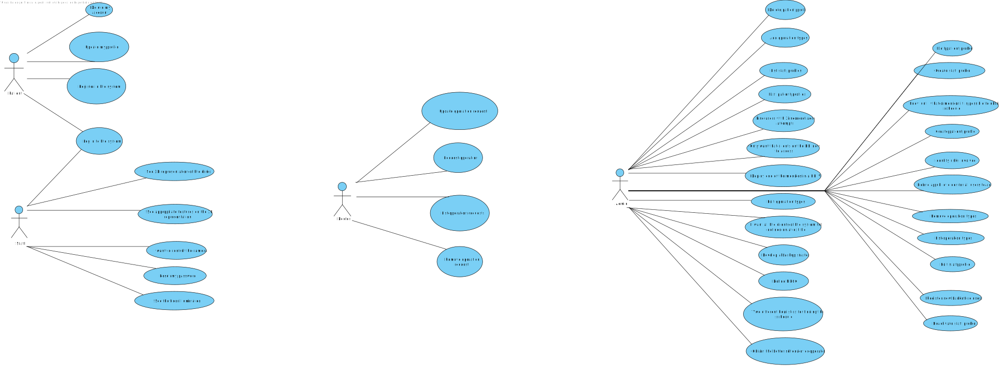
### Vista Lógica
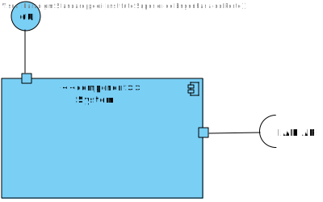
### Vista de Processos
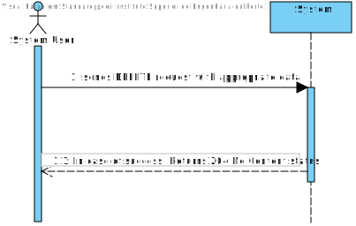

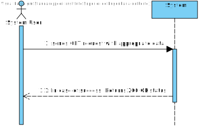

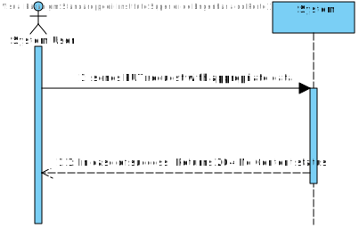

## Nível 2

### Vista Lógica
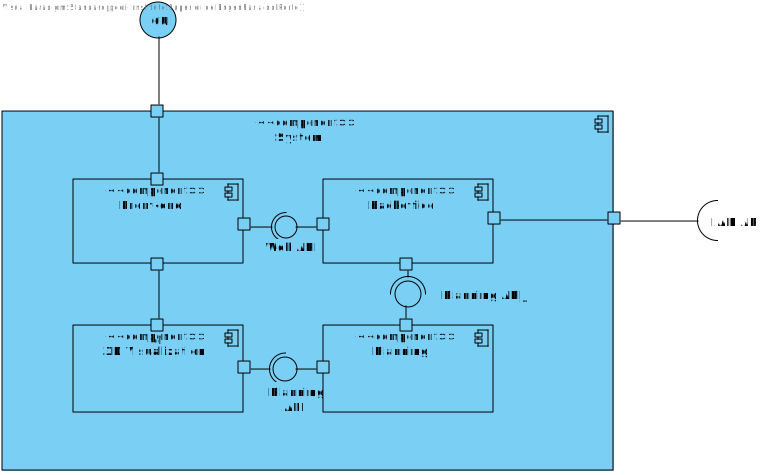
### Vista de Implementação
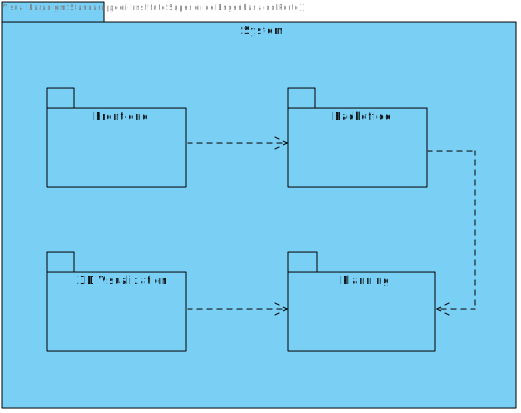

## Nível 3

### Vista Lógica

#### Backoffice
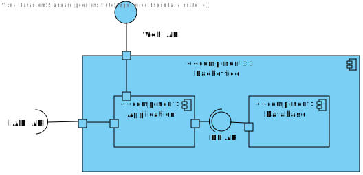

#### Front End
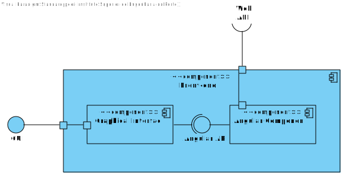

#### Planning
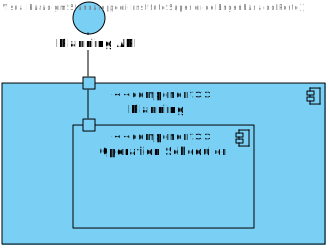

#### 3D Visualization
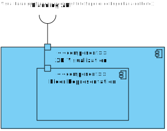

### Vista de Implementação

#### Backoffice
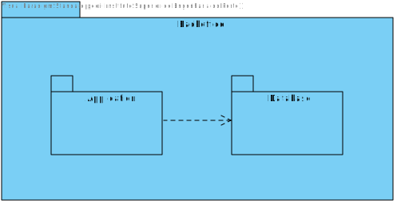

#### Front End
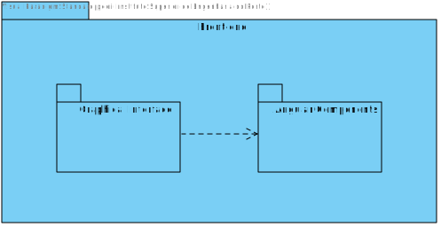

### Vista de Processos

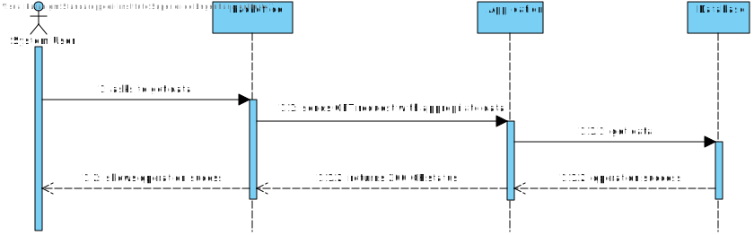

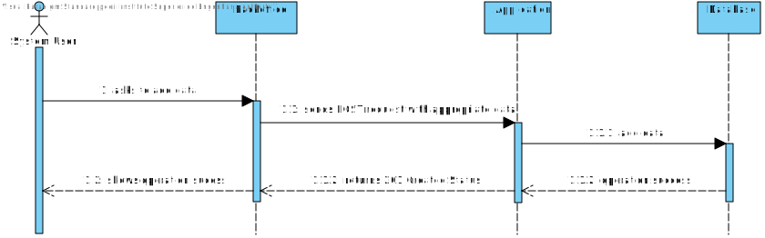

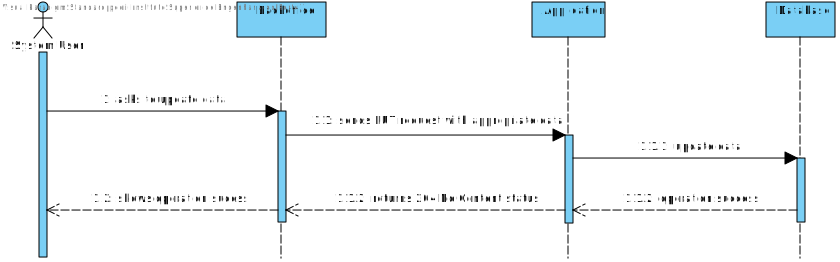

# Mapping

## Level 2 Development-Logic

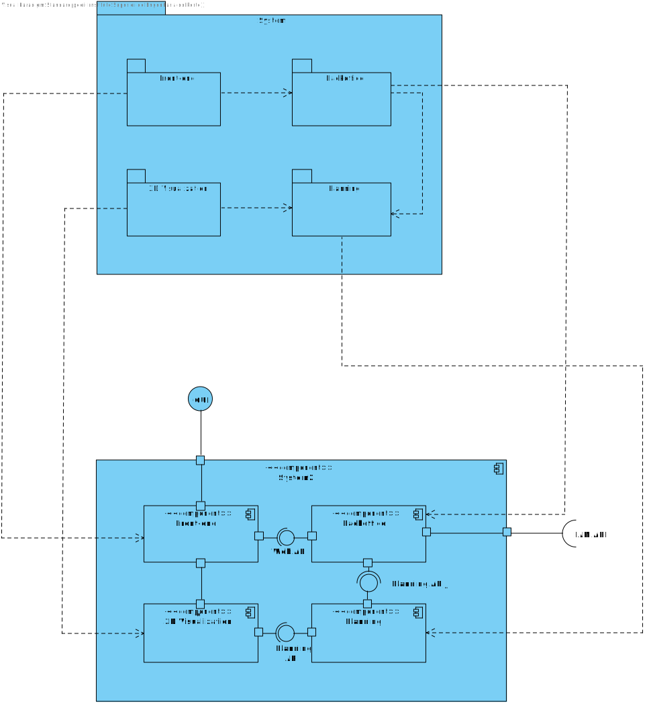